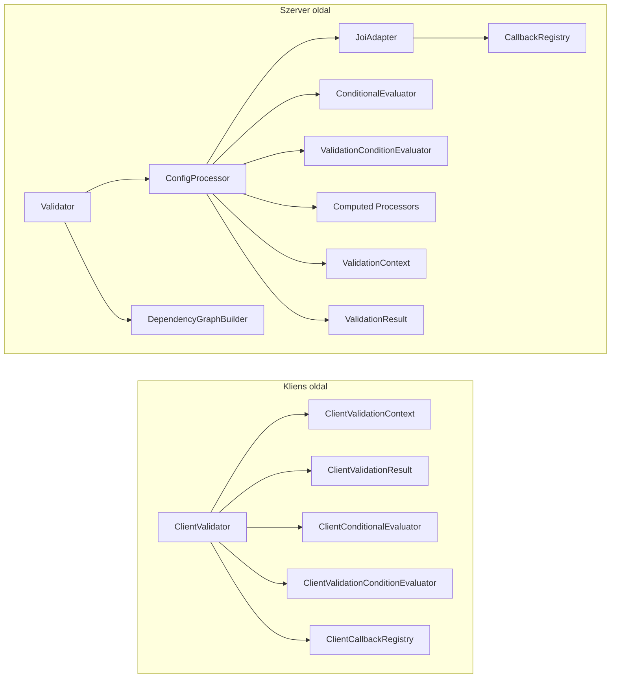
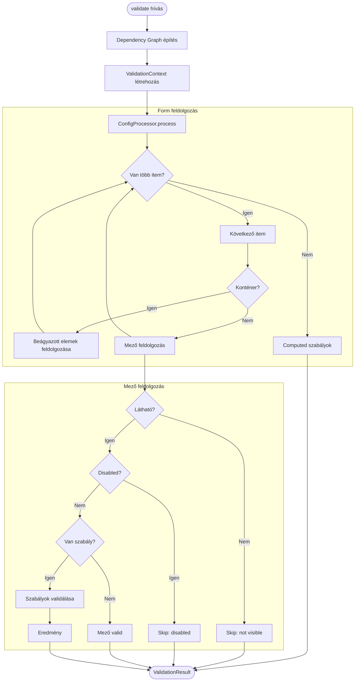
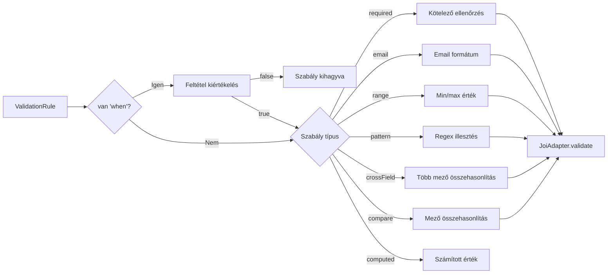
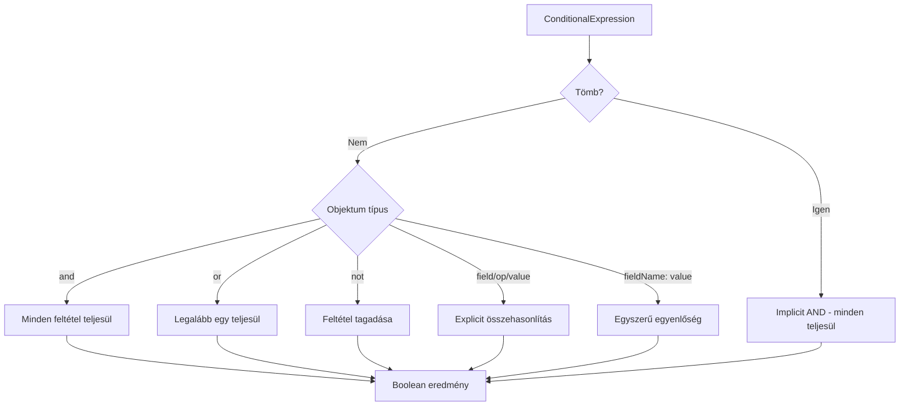
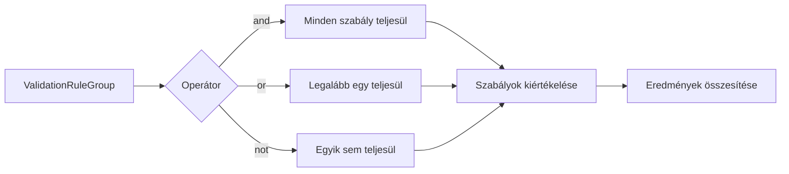
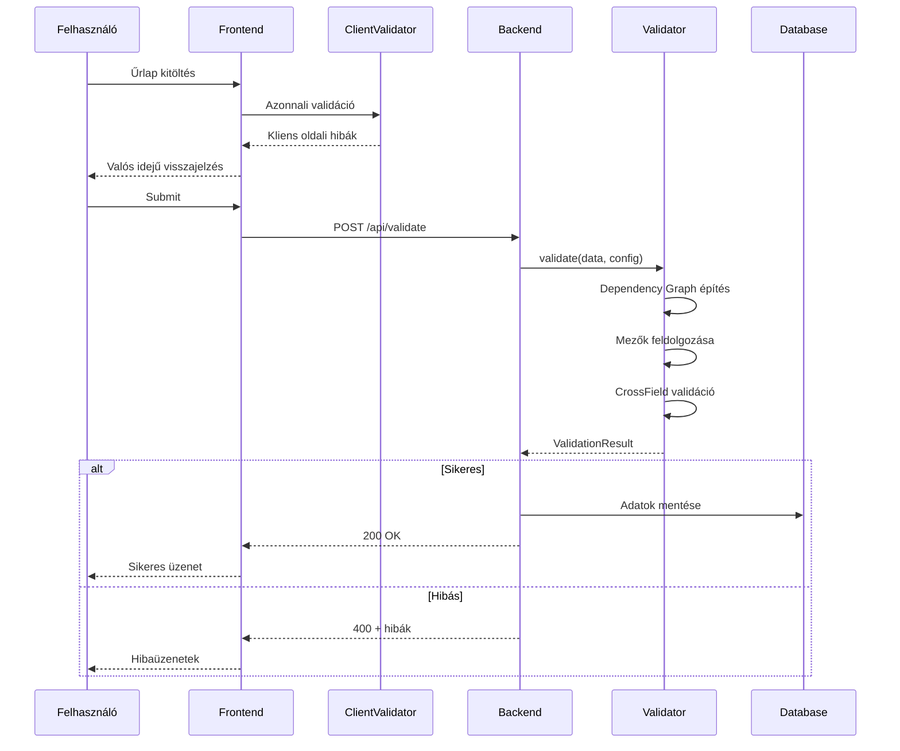
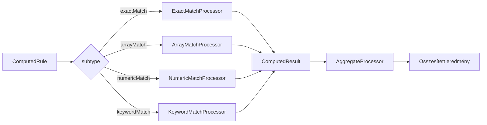
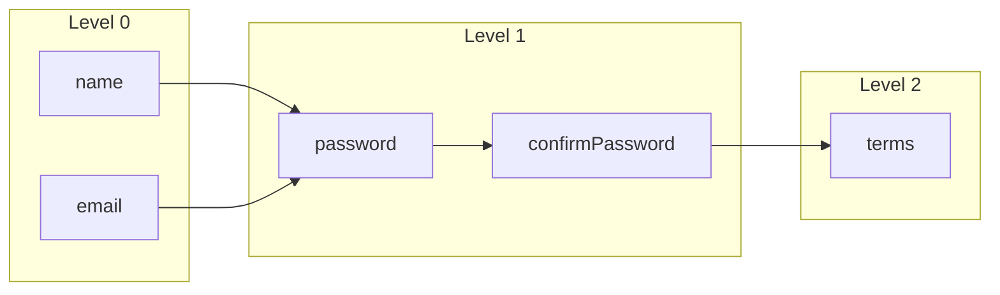

# FormFiller Validator - Validációs Rendszer

## Áttekintés

A FormFiller Validator egy dual-architektúrájú validációs rendszer, amely szerver és kliens oldalon is működik.

| Komponens | Környezet | Függőség | Jellemző |
|-----------|-----------|----------|----------|
| `Validator` | Szerver | Joi | Teljes funkcionalitás, async API hívások |
| `ClientValidator` | Böngésző | Nincs | Könnyűsúlyú, azonnali visszajelzés |

---

## Architektúra



---

## Fő Komponensek

### Szerver oldal

| Komponens | Leírás |
|-----------|--------|
| `Validator` | Fő belépési pont, Joi-alapú, async támogatás |
| `ConfigProcessor` | Form konfiguráció feldolgozása, mezők bejárása |
| `JoiAdapter` | Joi sémák generálása és cache-elése |
| `CallbackRegistry` | CrossField validátorok regisztrációja |
| `ValidationContext` | Validációs állapot és kontextus |
| `ValidationResult` | Eredmények és hibák tárolása |
| `ConditionalEvaluator` | visibleIf/disabledIf feltételek |
| `ValidationConditionEvaluator` | when feltételek szabályokon |
| `DependencyGraphBuilder` | Párhuzamos végrehajtás optimalizálás |
| `Computed Processors` | ExactMatch, ArrayMatch, NumericMatch, Aggregate |

```typescript
const validator = new Validator({ mode: 'parallel', cache: { enabled: true } });
const result = await validator.validate(formData, formConfig);
```

### Kliens oldal

| Komponens | Leírás |
|-----------|--------|
| `ClientValidator` | Könnyűsúlyú, Joi-mentes validator |
| `ClientValidationContext` | Kliens oldali kontextus |
| `ClientValidationResult` | Kliens oldali eredmények |
| `ClientConditionalEvaluator` | Feltételek kiértékelése |
| `ClientValidationConditionEvaluator` | when feltételek |
| `ClientCallbackRegistry` | Kliens oldali crossField validátorok |

```typescript
const validator = new ClientValidator();
const result = await validator.validate('email', value, rules, formData);
```

---

## Validációs Folyamat



---

## Szabály Validáció



---

## Támogatott Szabálytípusok

| Típus | Leírás | Paraméterek |
|-------|--------|-------------|
| `required` | Kötelező mező | - |
| `email` | Email formátum | - |
| `numeric` | Szám érték | - |
| `stringLength` | Szöveg hossz | `min`, `max` |
| `arrayLength` | Tömb méret | `min`, `max` |
| `range` | Szám tartomány | `min`, `max` |
| `pattern` | Regex minta | `pattern` |
| `compare` | Mező összehasonlítás | `comparisonTarget`, `comparisonType` |
| `crossField` | Több mező validáció | `targetFields`, `crossFieldValidator` |
| `computed` | Számított szabály | `subtype`, `expectedValue` |

---

## Feltételes Kiértékelés

A `ConditionalEvaluator` kezeli a `visibleIf`, `disabledIf`, `requiredIf`, `readonlyIf` és `when` feltételeket.



**Támogatott operátorok:** `==`, `!=`, `>`, `<`, `>=`, `<=`, `in`, `notIn`, `contains`, `startswith`, `endswith`

---

## Rule Group (Logikai Csoportok)

Szabályok logikai csoportosítása `and`, `or`, `not` operátorokkal.



---

## Use Case: Teljes Validációs Lánc



---

## Computed Processors

Számított szabályok feldolgozása különböző típusú egyezésvizsgálatokhoz.

| Processor | Leírás |
|-----------|--------|
| `ExactMatchProcessor` | Pontos érték egyezés |
| `ArrayMatchProcessor` | Tömb elemek egyezése |
| `NumericMatchProcessor` | Numerikus tartomány ellenőrzés |
| `KeywordMatchProcessor` | Kulcsszó keresés szövegben |
| `AggregateProcessor` | Több mező eredményeinek összesítése |



---

## CrossField Validátorok

Előre definiált cross-field validátorok a `CallbackRegistry`-ben:

| Név | Leírás |
|-----|--------|
| `passwordMatch` | Jelszavak egyezése |
| `emailMatch` | Email címek egyezése |
| `dateRangeValid` | Dátumok sorrendje |
| `numericRangeValid` | Számok sorrendje |
| `validateSumEquals` | Összeg ellenőrzés |
| `validatePercentageSum` | 100% összeg |
| `atLeastOneRequired` | Minimum egy kitöltött |

---

## Dependency Graph

Párhuzamos végrehajtáshoz a `DependencyGraphBuilder` épít függőségi gráfot.



- **Level 0**: Független mezők (párhuzamosan)
- **Level 1+**: Függő mezők (előző szint után)
- **Körkörös függőség detektálás**

---

## Projekt Struktúra

```
src/
├── core/                    # Szerver oldali core
│   ├── Validator.ts
│   ├── ValidationContext.ts
│   ├── ValidationResult.ts
│   └── CallbackRegistry.ts
├── validators/              # Kliens oldali validator
│   ├── ClientValidator.ts
│   ├── ClientValidationContext.ts
│   ├── ClientValidationResult.ts
│   ├── ClientConditionalEvaluator.ts
│   ├── ClientValidationConditionEvaluator.ts
│   └── ClientCallbackRegistry.ts
├── processors/              # Feldolgozók
│   ├── ConfigProcessor.ts
│   ├── ConditionalEvaluator.ts
│   ├── ValidationConditionEvaluator.ts
│   └── computed/            # Computed processors
├── adapters/
│   └── JoiAdapter.ts
├── utils/
│   ├── DependencyGraphBuilder.ts
│   ├── FieldPathBuilder.ts
│   └── typeGuards.ts
└── types/
    └── index.ts
```

---

## Összefoglaló

1. **Dual architektúra**: Kliens (gyors) + Szerver (teljes)
2. **Feltételes validáció**: `when`, `visibleIf`, `disabledIf`
3. **CrossField**: Több mező együttes validációja
4. **Rule Groups**: Logikai operátorok (`and`/`or`/`not`)
5. **Dependency Graph**: Optimalizált, párhuzamos végrehajtás
6. **Computed Rules**: Számított értékek és aggregációk
7. **Extensible**: Egyedi validátorok regisztrálhatók

